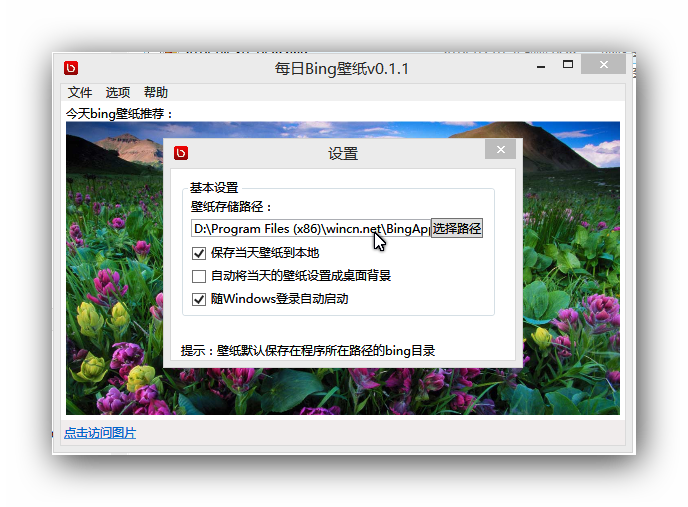
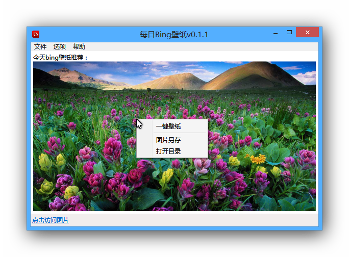
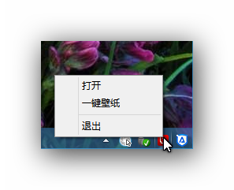

BingApplication
===
c#写的一个获取bing壁纸的应用

# 软件截图

# 更新说明：

## V0.1.1
1. 加入自定义是否自动下载图片功能
2. 加入一键将当前图片设置为桌面壁纸功能
3. 修复程序退出时任务栏延迟及提示的bug
4. 其他功能优化

## V0.1.0
1. 加入最小化系统托盘功能
2. 加入支持开机自启动功能
3. 加入打开图片所在目录功能
4. 加入右键支持
5. 其他性能优化

# 主要功能：
1.	与必应壁纸同步，一天给您带来一张有趣唯美的图片
2.	支持一键将图片设置为桌面壁纸
3.	支持每天自动更换桌面壁纸
4.	方便管理
